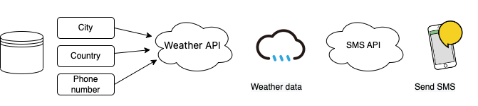

# Sending a detailed weather notification sms.

An application that sends an sms containing the weather's status to the users based on their city and country.

The aim of this project is to put into practice multiple ways to use APIs and also to connect them with each othe in order to get the exact needed information.

The code features the implementation of 4 different APIs :

- [Open-Meteo](https://open-meteo.com/en/docs#latitude=48.85&longitude=2.35&hourly=temperature_2m,relativehumidity_2m,precipitation,rain,snowfall,snow_depth,weathercode,visibility,windspeed_10m&daily=weathercode,temperature_2m_max,temperature_2m_min,sunrise,sunset,precipitation_hours,windspeed_10m_max,windgusts_10m_max,winddirection_10m_dominant&timezone=auto) : A Weather Forecast API that gives the weather's detailed variables based on latitude and longitude.
- [Ninjas API](https://api-ninjas.com/api/geocoding): A geocoding API that returns a list of city names and coordinates (latitude/longitude) that match a given city name.
- [Textbelt API](https://docs.textbelt.com#testing-this-api): An SMS API to send SMS texts.
- [Google spreadsheet API](https://developers.google.com/sheets/api) : A google API that manages to read a spreadsheet dataset and use its values.

The code contains 2 main python files :
- [Main](https://github.com/Oumaima-Hajji/city-weather/blob/main/main.py) : For execution.
- [Utils](https://github.com/Oumaima-Hajji/city-weather/blob/main/utils.py) : Contains all methods used.

The code takes the **city**, **country** and **phone number** of the subscribers listed on the Google-sheet dataset and sends them all an SMS text with a detailed status of that same day's weather.

